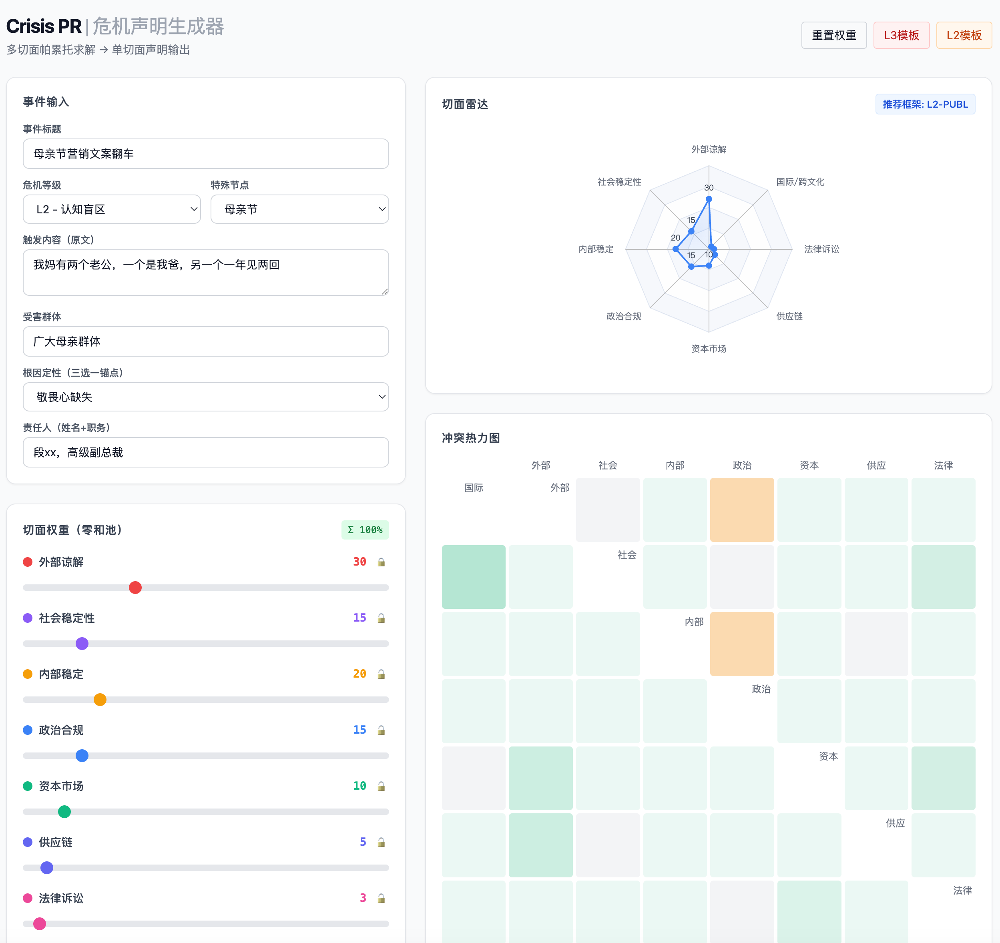

## 一、项目定位

**`crisis-pr`** 是一个纯前端危机公关声明生成器。它将危机公关从“凭感觉写稿”升级为**多约束帕累托求解 + 单切面声明输出**的决策工程。

人类决策者通过可视化界面评估 8 个危机切面、调整权重、观察冲突热力，系统根据主切面锁定策略，编译出面向单一受众的致歉声明正文。

> **核心原则**：后台做帕累托求解，前台只做单一切面表达。其他切面通过独立 Sidecar 渠道并行处理，绝不挤进正文。

---

## 二、核心设计理念

| 传统做法 | `crisis-pr` 做法 |
|---|---|
| 一份声明求平衡，八面玲珑 | 一份声明只服务一个主切面，精准打击 |
| 写稿人凭经验判断语气 | 系统根据危机等级自动锁定 L1/L2/L3 框架 |
| 高管实名/匿名靠拍脑袋 | 切面权重自动推荐披露策略，人类可覆盖 |
| 否定式 Prompt（“不要写XX”） | 正向占领式 Prompt（“只写XX”）+ 后验 Guardrail |
| 单文件 Word 来回改 | 零和滑块实时互斥，雷达图即时反馈 |

---

## 三、功能特性

### 3.1 多切面零和决策系统
- **8 核心切面**：外部谅解、社会稳定性、内部稳定、政治合规、资本市场、供应链、法律诉讼、国际/跨文化
- **零和滑块**：总权重池锁定 100%，拖动任一滑块，其余未锁定项按当前比例自动分摊
- **锁定机制**：点击 🔒 固定主切面，被锁定项不受其他滑块拖动影响

### 3.2 可视化决策仪表盘
- **雷达图**：8 维切面分布，主切面高亮，中心标注推荐框架（如 `L3-ETHIC`）
- **冲突热力图**：8×8 矩阵实时计算冲突张力，高危冲突对闪烁预警（如“外部谅解 ↔ 法律诉讼”）
- **策略预览**：声明框架、语气档位、禁忌词拦截状态、高管披露策略

### 3.3 信息分级与披露策略
- **原始事实层**：高管姓名、具体处罚、内部复盘（仅作为背景知识输入）
- **策略决策层**：系统根据切面权重自动推荐对外披露策略：
  - `实名`：姓名 + 职务（外部谅解主导）
  - `职务代称`：仅职务（平衡内部稳定）
  - `匿名`：负责人（法律风险高）
  - `不提及个人`：管理层（L1 产品缺陷）
- **人类终审权**：推荐策略可一键覆盖

### 3.4 单切面声明生成
- **框架路由**：`L3-ETHIC` / `L2-COGNITIVE` / `L1-SERVICE` / `L3-DATA` / `L3-POLITICAL`
- **五段式骨架**：事实确认 → 影响承认 → 根因认罪 → 处置公示 → 行动承诺
- **正向 Prompt 工程**：白名单式角色锚定 + 输出格式预填充 + 语义空间压缩
- **后验 Guardrail**：代码层硬规则拦截，失败触发重写指令

### 3.5 LLM 流式生成
- 支持 OpenAI 兼容接口（GPT-4o / Claude / 本地模型）
- 纯前端调用，API Key 仅存储于本地内存
- 流式输出，实时渲染

---

## 四、快速开始

### 4.1 运行
```bash
# 无需构建，直接打开
open crisis-pr.html
```

### 4.2 配置 LLM
在界面右下角填写：
- **API Endpoint**：`https://api.openai.com/v1/chat/completions`
- **Model**：`gpt-4o`
- **API Key**：你的 Key（仅前端内存存储，不落地）

### 4.3 生成流程
1. **输入事件**：标题、触发内容、受害群体、根因锚点、问责高管
2. **滑动权重**：调整 8 个切面滑块，观察雷达图与冲突热力图
3. **确认策略**：检查系统推荐的“对外披露策略”，必要时人工覆盖
4. **点击生成**：系统编译 Prompt，流式输出声明正文
5. **复制/下载**：一键导出 Markdown

---

## 五、架构说明

```
┌─────────────────────────────────────────┐
│  人类决策层（可视化界面）                  │
│  ├─ 事件表单输入                          │
│  ├─ 零和滑块 + 锁定机制                   │
│  ├─ 雷达图 + 冲突热力图                   │
│  └─ 披露策略确认（实名/代称/匿名）         │
├─────────────────────────────────────────┤
│  策略编译层（JS 逻辑）                     │
│  ├─ 主切面锁定（权重最高项）               │
│  ├─ 框架路由（L3-ETHIC 等）               │
│  ├─ 冲突张力计算（baseStrength × 资源压力） │
│  └─ 信息分级释放（仅放行策略允许的信息）     │
├─────────────────────────────────────────┤
│  Prompt 编译层                            │
│  ├─ System Prompt：角色锚定 + 白名单格式    │
│  ├─ User Prompt：正文素材 + 背景知识隔离    │
│  └─ 温度锁定：temperature = 0.3            │
├─────────────────────────────────────────┤
│  LLM 生成层                               │
│  └─ 流式输出 → 后验 Guardrail 校验        │
├─────────────────────────────────────────┤
│  输出物                                   │
│  ├─ statement.md（对外声明，单一切面）      │
│  ├─ internal.md（内部通告，Sidecar）        │
│  ├─ regulatory.md（监管报备，Sidecar）      │
│  └─ legal.md（法律审查意见，Sidecar）       │
└─────────────────────────────────────────┘
```

---

## 六、切面模型速查

### 6.1 核心切面（8 个）

| 切面 | 主责 | 声明正文出现？ |
|---|---|---|
| **外部谅解** | 公众情绪修复 | ✅ 主切面，唯一正文主角 |
| **社会稳定性** | 舆情扩散控制 | ❌ 通过评论策略/发布渠道保底 |
| **内部稳定** | 组织连续性 | ❌ 通过内部通告 Sidecar 处理 |
| **政治合规** | 监管关系 | ❌ 通过前置报备 Sidecar 处理 |
| **资本市场** | 股东信心 | ❌ 通过 IR 沟通 Sidecar 处理 |
| **供应链** | 合作伙伴 | ❌ 通过渠道一对一 Sidecar 处理 |
| **法律诉讼** | 诉讼风险 | ❌ 通过法务审查 + 措辞边界保底 |
| **国际/跨文化** | 海外影响 | ❌ 通过本地化团队 Sidecar 处理 |

### 6.2 冲突对矩阵（高危组合）

```
外部谅解 ◄───高危───► 法律诉讼   （认罪 vs 自认）
外部谅解 ◄───高危───► 内部稳定   （问责 vs 士气）
政治合规 ◄───中危───► 资本市场   （低调 vs 信心）
社会稳定性 ◄─中危──► 资本市场   （扩散 vs 恐慌）
```

### 6.3 框架路由表

| 危机类型 | 定级 | 推荐框架 | 主切面 |
|---|---|---|---|
| 母亲节/灾难消费/民族情感 | L3 | `L3-ETHIC` | 外部谅解 |
| 性别刻板/地域歧视 | L2 | `L2-COGNITIVE` | 外部谅解 |
| 系统宕机/发货延迟 | L1 | `L1-SERVICE` | 外部谅解 |
| 数据泄露/隐私侵权 | L3 | `L3-DATA` | 法律诉讼 |
| 地图错误/主权表述 | L3 | `L3-POLITICAL` | 政治合规 |

---

## 七、Prompt 工程策略

### 7.1 白名单式角色锚定
```
你的身份：品牌面向公众的"首席道歉官"
你的受众：受到伤害的公众、媒体、泛舆论场
你无权代表：HR、法务、IR、GR 部门
```

### 7.2 信息分级释放
- **【正文素材】**：策略允许输出的信息（职务代称、概括处罚、可验证承诺）
- **【背景知识】**：仅用于理解上下文，绝对不出现在正文（真实姓名、具体降职月数、法务结论、报备状态）

### 7.3 格式预填充（结构挤占）
每段给出 `只写：XXX` + `不写：XXX`，且 `只写` 在前、篇幅占比 3:1，物理挤占模型发散空间。

### 7.4 后验 Guardrail（第三层保险）
```javascript
const internalPhrases = ["员工", "士气", "内部整顿", "监管报备", "股东", "基本面"];
// 检测到则触发重写指令，不返回给用户
```

---

## 八、配置项说明

| 配置 | 类型 | 默认值 | 说明 |
|---|---|---|---|
| `crisisLevel` | 枚举 | `L3` | L1/L2/L3，决定语气档位 |
| `primaryFacet` | 只读 | 自动计算 | 权重最高切面，不可手动编辑 |
| `publicDisclosure` | 枚举 | 自动推荐 | 实名 / 职务代称 / 匿名 / 不提及 |
| `temperature` | 固定 | `0.3` | 低创意，高合规，不可调 |
| `maxTokens` | 固定 | `800` | 约 500 汉字声明 + 缓冲 |

---

## 九、截图

> 以下为界面模块示意图，实际运行效果以浏览器渲染为准。



---

- **UI**：Tailwind CSS（CDN）
- **图表**：ECharts 5（CDN）
- **逻辑**：原生 JavaScript（无框架依赖）
- **LLM**：OpenAI 兼容接口，纯前端 Fetch + ReadableStream
- **存储**：无，刷新即重置（生产环境建议接入本地存储或后端）

---

## 十一、Roadmap

- [ ] 接入 sqlite/IndexedDB 保存历史危机决策快照
- [ ] 支持 YAML 配置导入，适配不同行业切面模板（快消/金融/政务）
- [ ] 增加"暂停/继续"流式控制
- [ ] 后端 Go 代理层，隐藏 API Key，增加审计日志
- [ ] 多语言声明输出（中文 → 英文/东南亚语种，适配出海企业）

---

## 十二、License

MIT

---

**设计哲学重申**：危机公关不是写八股文，而是做帕累托求解。`crisis-pr` 让人类负责判断，AI 负责编译，系统负责拦截割裂表达。